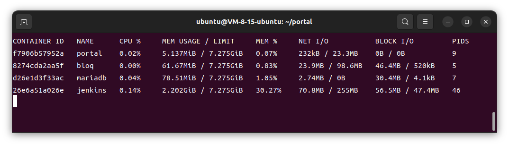
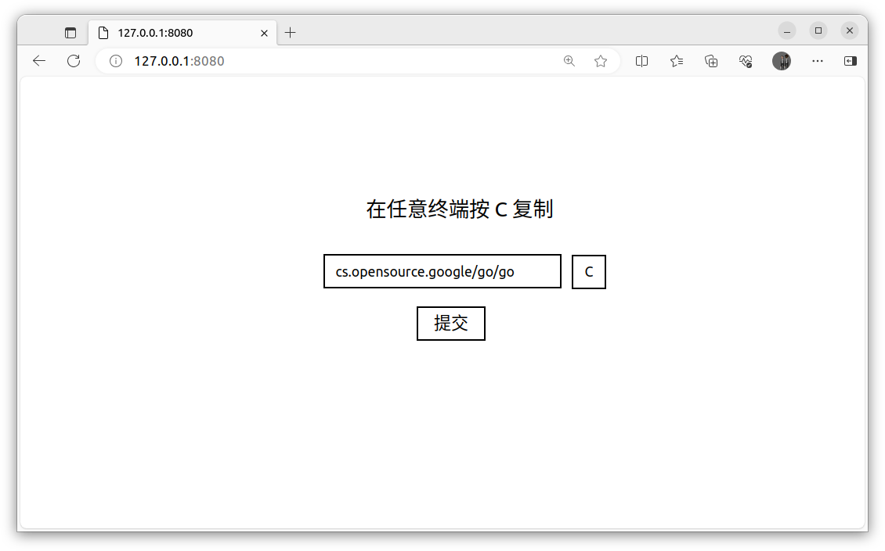
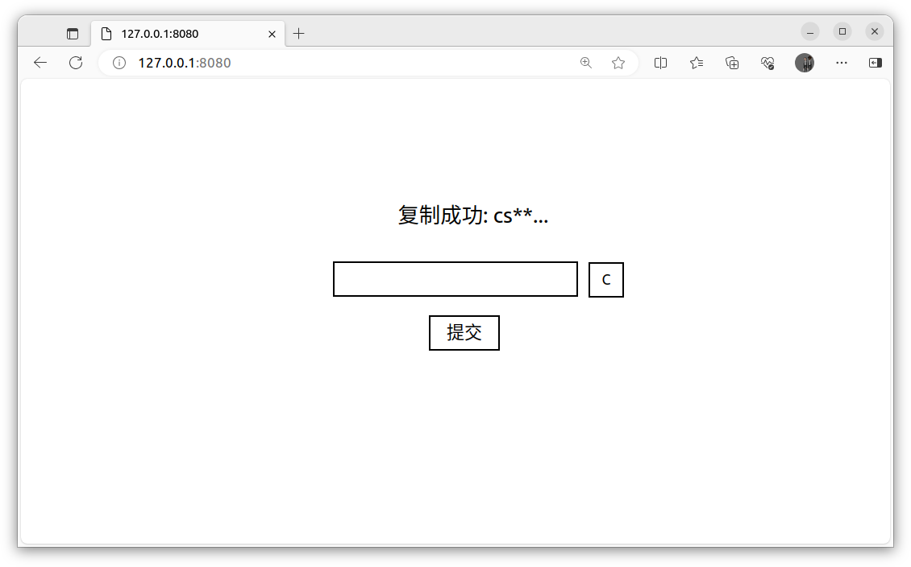

# Dioxus + Rust-Actix/Go-Fiber 的粘贴板网站 Portal

本项目实现了一个可以快速启动并部署的 **WASM** 粘贴板网站，通过浏览器在多个平台实现文本内容的复制粘贴功能（主要解决我个人使用 Ubuntu 遇到的各种不方便）。

项目使用 [Dioxus](https://dioxuslabs.com/) 作为 UI 框架、[Trunk](https://trunkrs.dev/) 作为前端构建工具，并有多个语言及框架的后端版本（比如 **Rust** 的 [Actix](https://actix.rs/) 及 **Go** 的 [Fiber](https://gofiber.io/)）。本项目选择使用 GraphQL 作为接口协议，并推荐使用 Docker 运行本项目，其中包含一个 Nginx 服务与后端服务（总共所需资源很小，在 Actix 后端环境中的运行内存约 8MB 左右）

**Docker 快速搭建方式**

1. 设置 JWT_KEY 和用户密码：创建 .env 文件，内容为： `PORTAL_JWT_KEY={任意JWT_KEY} PORTAL_USERNAME={你的用户名} PORTAL_PASSWORD={你的密码}`。

2. 项目目录下执行 `docker build -t portal -f {对应版本 Dockerfile，如 'Dockerfile.actix'} .`。

3. .env 目录执行 `docker run -d --rm --env-file .env -p 8080:8080 --name portal portal`

4. 多设备访问服务器 8080 端口，进行数据快速复制。

**开发环境**

1. 设置 JWT_KEY 和用户密码：项目目录下创建 .env 文件，内容为： `PORTAL_JWT_KEY={任意JWT_KEY} PORTAL_USERNAME={你的用户名} PORTAL_PASSWORD={你的密码}`。

2. 安装 Cargo 环境和 WASM 工具 Trunk (`cargo install trunk --version 0.16.0`)，执行 `rustup target add wasm32-unknown-unknown`。

3. 安装 npm 环境，执行 `npm i tailwindcss -g`。

4. 在对应的 server 目录下执行运行指令，actix-server 为 `cargo run .`。

5. 在 client 目录下执行 `trunk serve` 运行前端部分。

